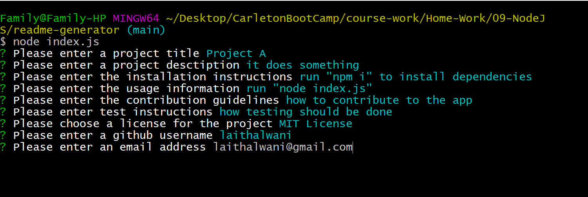
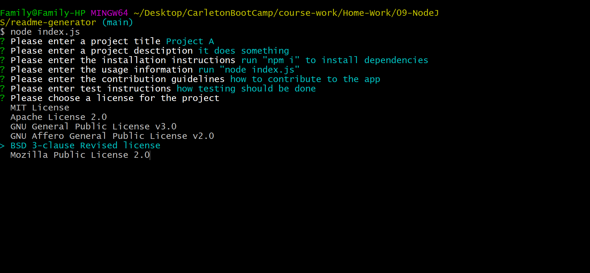

#  README Generator  

## Table of Content:
1.[Description](#Description)

2.[Installation Instructions](#Installation-Instructions)

3.[Usage Information](#Usage-Information)

4.[Questions](#Questions)

5.[Demo](#Demo)

6.[Liscense](#License)

## Description:
The README Generator app generates a professional markdown readme file by having the user answer a series of questions.
  

## Installation Instructions:
* install lates version of node.js
* run "npm i"  in the console in order to install all the depencies used to make this application

## Usage Information: 
to start the application use "node index.js" to invoke the application, answer the questions, after all the questions have been answered a readme file will be generate under the name "generated README.md"
  

## Questions:
Github: [laithalwani](https://github.com/laithalwani)
email: laithalwani@gmail.com

## Demo:
[Demo video](https://youtu.be/aN94D1-CO8s)

## License:
This application is covered under the .